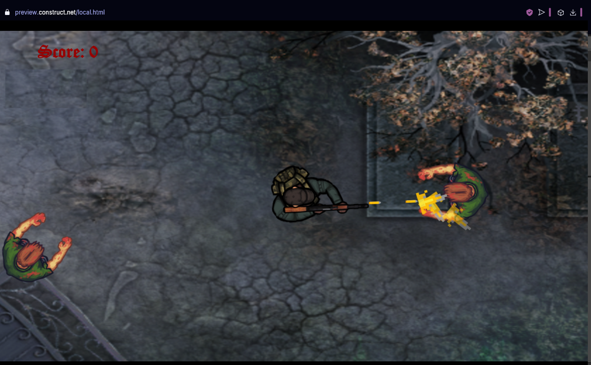
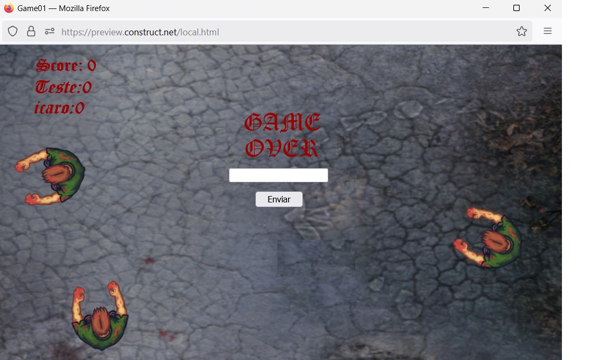
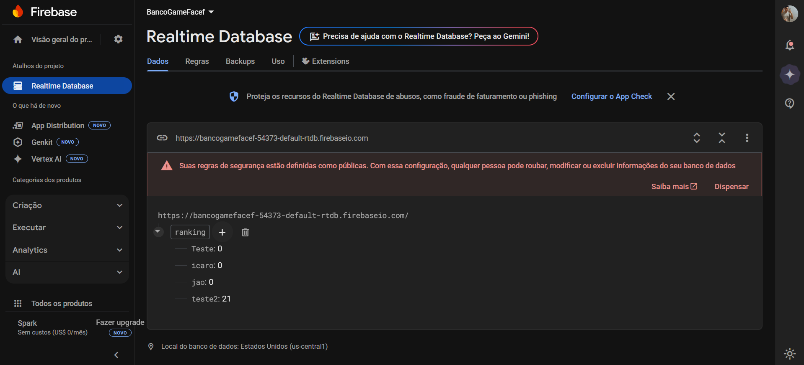

# 🧟‍♂️ Walking Dead — Mini-Game em Construct 3

> Protótipo criado em horários de lazer para explorar tecnologias web-first,
> arquitetura enxuta e padrões de código limpo.

## 🎮 Visão Geral
Walking Dead é um top-down shooter casual onde você controla um sobrevivente cercado por hordas de zumbis.  
O objetivo é resistir o máximo de tempo possível, acumulando pontos a cada inimigo eliminado.

### Objetivos do Projeto
- **Experimentação tecnológica** &nbsp;🔬 — testar capacidades do *Construct 3* integrando‐o a serviços externos.
- **Boas práticas de engenharia** &nbsp;🛠️ — aplicar OOP, SOLID e separação de camadas mesmo em um jogo simples.
- **Diversão** &nbsp;😄 — servir como playground em momentos de folga.

## 🚀 Funcionalidades Principais
- Controle responsivo do personagem (teclas WASD + mouse).
- Inimigos com “states” distintos (vagar, perseguir, atacar) via máquina de estados.
- Pontuação em tempo real, salva no **Firebase Realtime DB**.
- Efeitos sonoros e sprites otimizados para web (lazy loading).

## 🏗️ Arquitetura & Boas Práticas
| Camada | Papel | 
| ------ | ----- | 
| **Model** | Estado do jogo (vida, munição, score) | 
| **View**  | Sprites, UI e partículas                | 
| **Controller** | Lógica de transição de estado, input |

- **OOP & Componentes**: inimigos são instâncias da classe `Enemy`, reutilizável para variações futuras.  
- **SOLID**: cada script tem uma responsabilidade (ex.: `ScoreService` só lida com leitura/escrita de pontos).  
- **Persistência**: decisões CAP 👉 priorizamos **Disponibilidade** e **Escalabilidade**; eventual consistência é aceitável para leaderboard.

## 🖼️ Screenshots

## 🌐 Jogue Agora
[**▶️ Play on Construct.net**](https://www.construct.net/en/free-online-games/walking-dead-game-75983/bd70a3c7-3565-4f18-9930-ee49377a9303)
